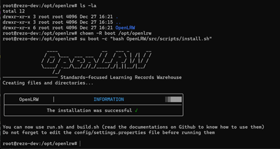
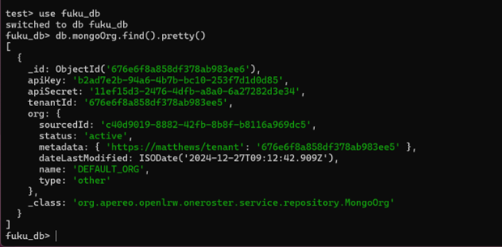

LRSは，学習活動のデータを保存，管理，共有するためのシステムである．  
OpenLRWは，Java ベースで開発された学習記録のためのシステムである．  

本研究では，オープンソースの，OpenLRW 1.2.3を採用した．  

# インストール
以下のコマンドを実行し，インストールする．  
```
Useradd -m -c "Boot User" boot
mkdir /opt/openlrw/
cd /opt/openlrw/
git clone https://github.com/Apereo-Learning-Analytics-Initiative/OpenLRW
chown -R boot /opt/openlrw
su boot -c "bash OpenLRW/src/scripts/install.sh"
```
&nbsp;  


# ビルド
以下のコマンドを実行し，ビルドする．  
```
su boot -c "bash build.sh"
```

# MongoDBのパス設定
conf/settings.propertiesファイルに，mongodbのパスを設定する．
```
mongodb://localhost:27017/fuku_db
```

# OpenLRW実行
OpenLRWを実行し，MongoDBに初期DBを構築する．  
```
su boot -c "bash run.sh start"
```

mongoshを実行し，生成されたテーブルからキーを取得する．  
&nbsp;  



