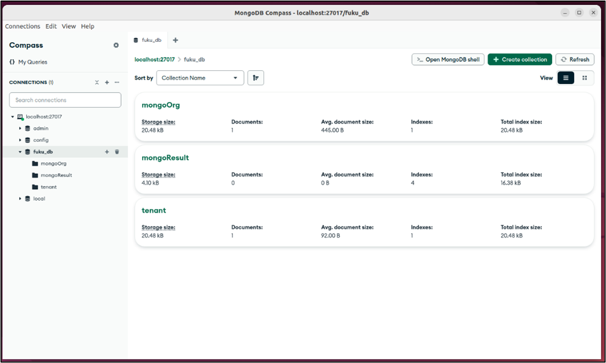

GUIで，イベントを確認する際に使用する．（任意）

# MongoDB Compass をダウンロードする．
```
wget https://downloads.mongodb.com/compass/mongodb-compass_1.44.5_amd64.deb
```

# MongoDB Compass をインストールする．
```
sudo dpkg -i mongodb-compass_1.44.5_amd64.deb
sudo apt-get install -f # This installs required compass dependencies
```

デスクトップからGUIを起動する．  

## Ubuntu 22.04 GUI　MongoDB Compass　起動例

