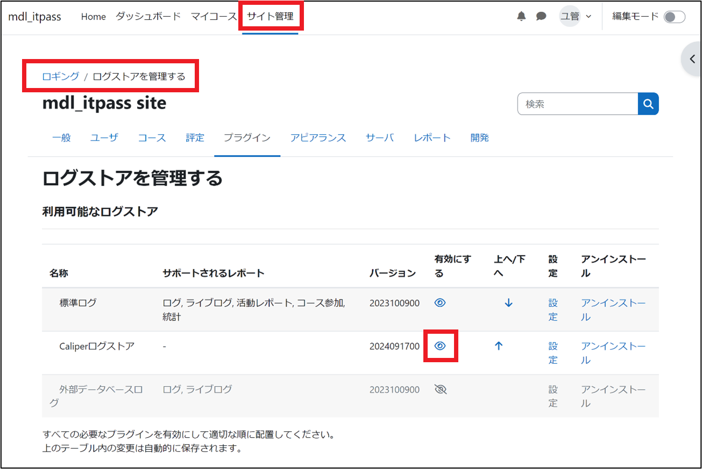

Caliper log storeは，IMS Caliper 1.0仕様に準拠したMoodle用プラグインであり，LMSで発生したイベントを，LRSに出力する．  
本研究では，MoodleのプラグインであるCaliper log store 4.3.4を採用した．  
  
Caliper log storeは以下のように，インストールする．  

# インストール
以下のURLから，インストール用圧縮ファイルをダウンロードし，インストールする．  
```
https://moodle.org/plugins/logstore_caliper
```

# プラグイン設定
イベントストアURL，APIキー，即時送信を設定する．  

## Caliper log storeプラグイン設定例


mongoshでapikeyを取得する例を，以下に示す．  
```
fuku_db> db.mongoOrg.find().pretty()
[
  {
    _id: ObjectId('676e6f8a858df378ab983ee6'),
    apiKey: 'b2ad7e2b-94a6-4b7b-bc10-253f7d1d0d85',  //このKeyをプラグインに設定する
    apiSecret: '11ef15d3-2476-4dfb-a8a0-6a27282d3e34',
    tenantId: '676e6f8a858df378ab983ee5',
    org: {
      sourcedId: 'c40d9019-8882-42fb-8b8f-b8116a969dc5',
      status: 'active',
      metadata: { 'https://matthews/tenant': '676e6f8a858df378ab983ee5' },
      dateLastModified: ISODate('2024-12-27T09:12:42.909Z'),
      name: 'DEFAULT_ORG',
      type: 'other'
    },
    _class: 'org.apereo.openlrw.oneroster.service.repository.MongoOrg'
  }
]
```

# プラグイン有効化
サイト管理→　ロギングを選択し，プラグインを有効化する．  

## プラグインの有効化


