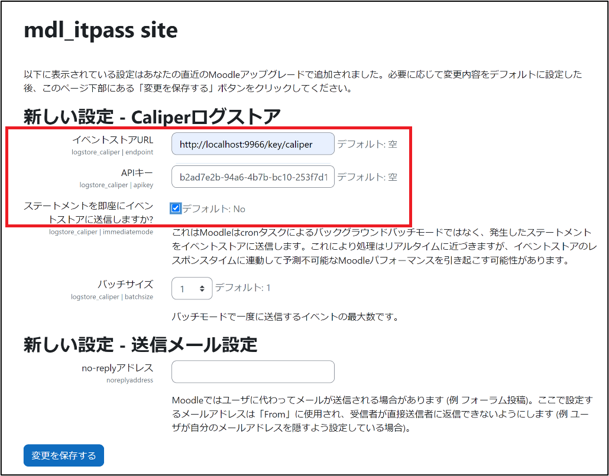

Caliper log storeは，IMS Caliper 1.0仕様に準拠したMoodle用プラグインであり，LMSで発生したイベントを，LRSに出力する．  
本研究では，MoodleのプラグインであるCaliper log store 4.3.4を採用した．  
  
Caliper log storeは以下のように，インストールする．  

# インストール
以下のURLから，インストール用圧縮ファイルをダウンロードし，インストールする．  
```
https://moodle.org/plugins/logstore_caliper
```

# プラグイン設定
イベントストアURL，APIキー，即時送信を設定する．  

## Caliper log storeプラグイン設定例

