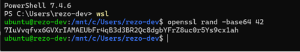

BIツールとは，ビジネスにおける大量のデータを収集・分析する機能を持つソフトウェアのことである．  
本研究では，オープンソースの，Apache Superset 4.1.0を採用した．  
Apache Supersetとは，Airbnb社が開発したデータの検索や可視化を行うためのオープンソースソフトウェアである．  
  
Supersetは以下のように，インストールし，設定する．  

# Supersetのインストール

## 必要パッケージなどインストールする
```
sudo apt install python3
sudo apt-get install build-essential libssl-dev libffi-dev python3-dev python3-pip libsasl2-dev libldap2-dev default-libmysqlclient-dev

sudo apt-get install python3-setuptools
pip3 install --upgrade pip
pip install --upgrade setuptools pip

apt install python3.10-venv
python3 -m venv supersetenv
source supersetenv/bin/activate
```

# Supersetをインストールする
```
pip install Superset
pip install Superset[cors]
```

# 環境変数を設定する
```
export FLASK_APP=superset
export SUPERSET_CONFIG_PATH=/home/ubuntu/superset_config.py
```

# SECRET_KEYを生成する
```
openssl rand -base64 42
```
## SECRET_KEY生成例


# superset_config.pyを作成する
このリポジトリのファイルを参照ください．

# Supersetの内部データベースのフォルダを作成する
```
mkdir /home/ubuntu/.superset
```

# adminアカウントを設定する
```
superset fab create-admin 
```

# Superset内部テーブルを初期化する
```
superset db upgrade
```

# Supersetを初期化する
```
superset init
```

環境変数にPUBLIC_ROLE_LIKE_GAMMA = True，PUBLIC_ROLE_LIKE = "Gamma"を設定した後，初期化を実行されると，Gammaロール権限が，Public権限にコピーされる．  

# Supersetを起動する
このコマンドは，Supersetのみ，個別起動の場合である．
（OpenLRW，Superset，Drillの一括起動は，を参照すること．）

```
#!/bin/bash
python3 -m venv venv
. venv/bin/activate

export FLASK_APP=superset
export SUPERSET_CONFIG_PATH=/home/ubuntu/superset_config.py

superset run -h gsis-fukuno.com -p 8088 --cert "/etc/ssl/ssl_fuku/server.crt" --key "/etc/ssl/ssl_fuku/server.key"
```


