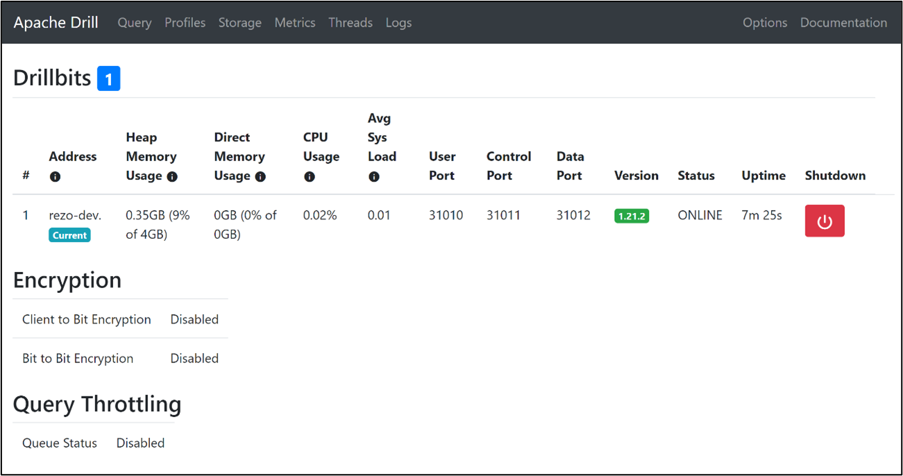
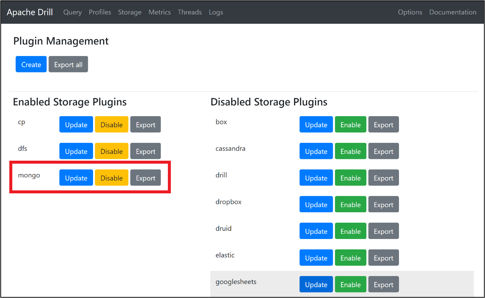

OpenLRWがデータを蓄積しているMongoDB（データベース）を，直接参照するために使用した．  
Apache Drillは，様々なデータベースに対応した，SQLクエリエンジンである．  
本研究では，オープンソースの，Apache Drill 1.21.2を採用した．  

# なぜ，Apache Drillを採用するのか

LAaaS-docker（RCOS）では，外部データラッパ（multicorn)と，データベース（PostgreSQL）を用いて，MongoDBのデータにアクセスしている．  
https://github.com/RCOSDP/LAaaS-docker/blob/master/superset-db/

外部テーブルのスキーマを明確に定義して，データアクセスを実現している．  
Apache Drillの場合，外部データラッパも，データベースも，外部テーブル定義も不要で，直接アクセスが可能である．  
MongoDBのデータからスキーマを解析するため，初回アクセス時のみ，時間がかかる．（５秒程度）  
それ以降は，高速アクセスが可能である．  
  
別の国際規格であるxAPIとLRS(MongoDB)への対応を検討する場合も，Apache Drillを使用すれば，同じ方式でアクセス可能である．
上記を踏まえ，Apache Drillを採用した．
  
Drillは以下のように，インストールする．   

# Apache Drillのインストール
## Drillをダウンロードする
以下のURLから，インストール用の圧縮ファイルをダウンロードする．  
```
https://drill.apache.org/download/
```

## Drillをインストールする
ディレクトリにファイルを移動し，圧縮ファイルを解凍する．  
```
cd /home/ubuntu/
tar -xvzf Drill-1.21.2.tar.gz
```

## Drillを起動する
```
cd /home/ubuntu/Drill-1.21.2
./bin/drill-embedded
```

## Web GUI表示
以下のURLをWebブラウザで表示する．  

> [!IMPORTANT]
> ※ポートを解放していない場合は，GUIから表示してください．

```
http://localhost:8047
```

### Drill管理画面例


## StorageのMongoDBプラグイン変更
Storageメニューより，mongoをEnableに設定する．  

### MongoDBを有効化


## Superset用のpackagesをインストールする．
```
python3 -m venv venv
. venv/bin/activate
pip install sqlalchemy-drill
```
