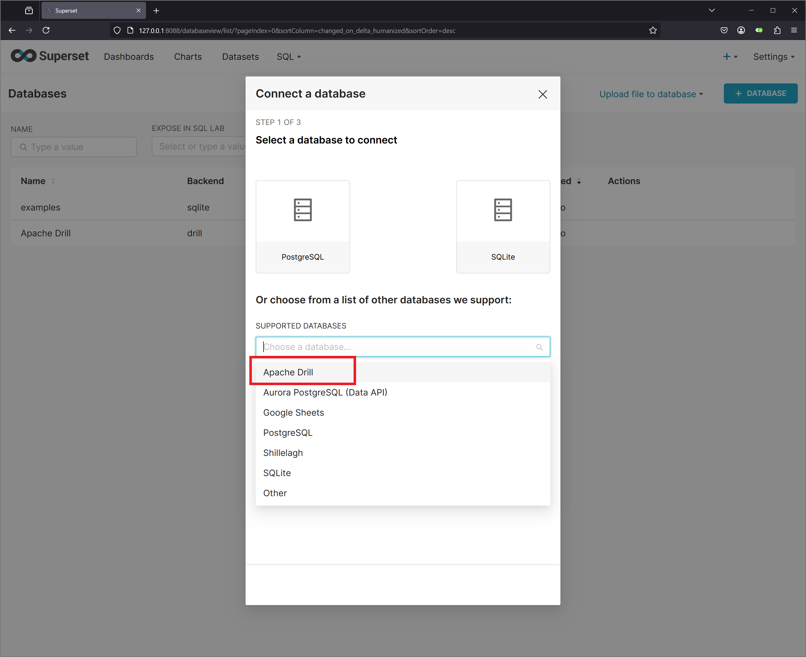
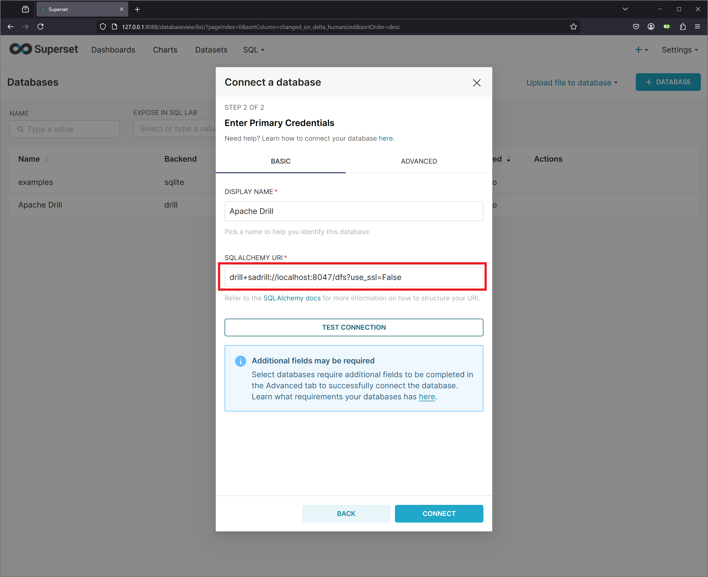

# Superset可視化設定
Supersetにコネクションを設定し，DrillからMongoDBのデータを読み込めるよう設定する．  

## コネクション設定
Supersetにログインし，Settingメニューから，Database Connectionsを選択する．  

### コネクション設定呼び出し


### データベース選択


## 接続情報を入力し，接続を確認する
接続情報  
```
drill+sadrill://localhost:8047/dfs?use_ssl=False
```
### URI設定例


## チャート用データセット
以下のSQLを，DS_MAINという名称で，DATASETに登録する．  

```
SELECT 
    DAY(mongoEvent.event.`eventtime`) AS FUKU_SEL_DD,
    HOUR(mongoEvent.event.`eventtime`) AS FUKU_SEL_HH,
    MINUTE(mongoEvent.event.`eventtime`) AS FUKU_SEL_MM,
    date_trunc('DAY', mongoEvent.event.`eventtime`) AS FUKU_EVTM_DAY,
    date_trunc('HOUR', mongoEvent.event.`eventtime`) AS FUKU_EVTM_HOUR,
    date_trunc('MINUTE', mongoEvent.event.`eventtime`) AS FUKU_EVTM_MIN,
    classId,
    mongoEvent.event.`group`.`_id` AS FUKU_COURCE_ID,
    mongoEvent.event.`group`.`name` AS FUKU_COURCE_NAME,
    split_part(mongoEvent.event.`action`,'#', 2) AS FUKU_ACT,
    userId,
    mongoEvent.event.`agent`.`name` AS FUKU_USER_NAME,
    concat(userId, ':', mongoEvent.event.`agent`.`name`) AS FUKU_ID_USER_NAME,
    mongoEvent.event.`target`.`_id` AS FUKU_TASK_URL,
    split_part(mongoEvent.event.`target`.`_id` ,'id=', 2) AS FUKU_TASK_ID,
    mongoEvent.event.`target`.`name` AS FUKU_TASK_NAME,
    split_part(mongoEvent.event.`membership`.`roles`[0],'#', 2) AS FUKU_ROLE
FROM 
    mongo.fuku_db.mongoEvent
ORDER BY
    classId,
    mongoEvent.event.`eventtime`
```
