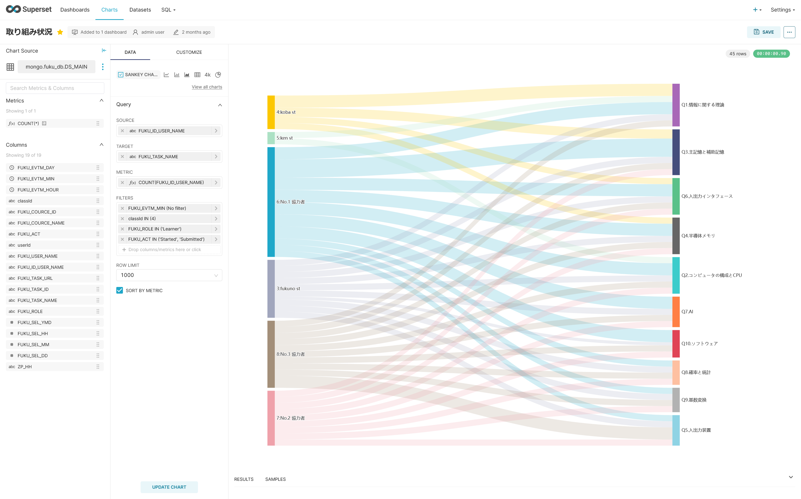

# 取り組み状況

データセット（DS_MAIN）を元に，SANKEY CHARTを用いて，可視化する． 

パラメタ | 値
|----|----|
SOURCE | ユーザーID＋ユーザー名
TARGET | タスク名
METRIC | ユーザーID＋ユーザー名ごとの回数
FILTER | ユーザー属性＝学習者（Learner） コースID＝４　※評価実験用に限定 アクション＝Started, Submitted　に限定
