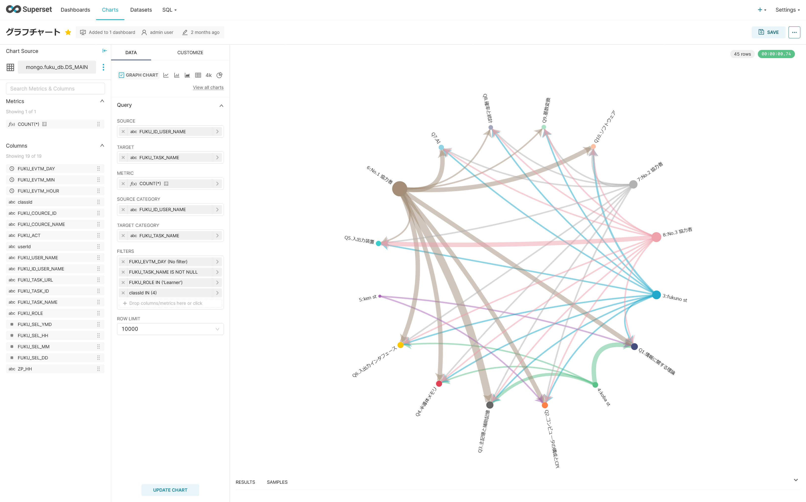

# グラフチャート

データセット（DS_MAIN）を元に，GRAPH CHARTを用いて，可視化する．

パラメタ | 値
|----|----|
SOURCE | ユーザーID＋ユーザー名
TARGET | タスク名
METRIC | 回数
SOURCE CATEGORY | ユーザーID＋ユーザー名
TARGET CATEGORY | タスク名
GRAPH LAYOUT | CIRCLE
FILTER | ユーザー属性＝学習者（Learner） コースID＝４　※評価実験用に限定 タスク名=NULL以外
