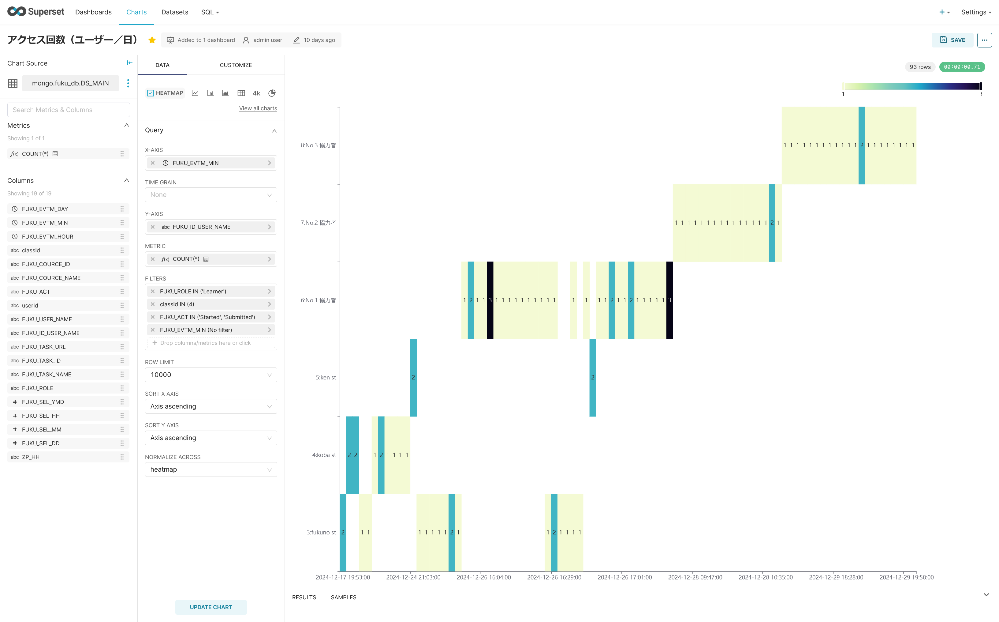

# アクセス回数（ユーザー／日）

データセット（DS_MAIN）を元に，HEATMAPを用いて，可視化する．

パラメタ | 値
|----|----|
X AXIS | イベント時刻（分単位に変換）
Y AXIS | ユーザーID＋ユーザー名
METRIC | 回数
FILTER | ユーザー属性＝学習者（Learner） コースID＝４　※評価実験用に限定 アクション＝Started, Submitted　に限定
