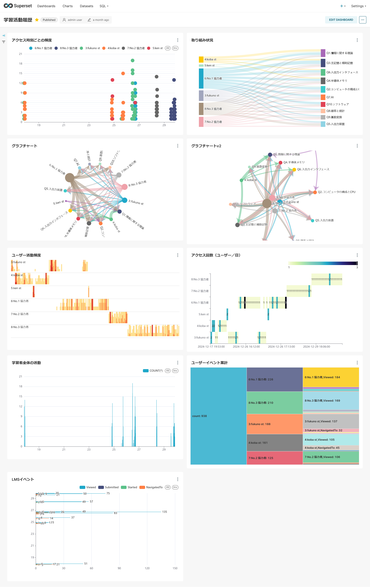
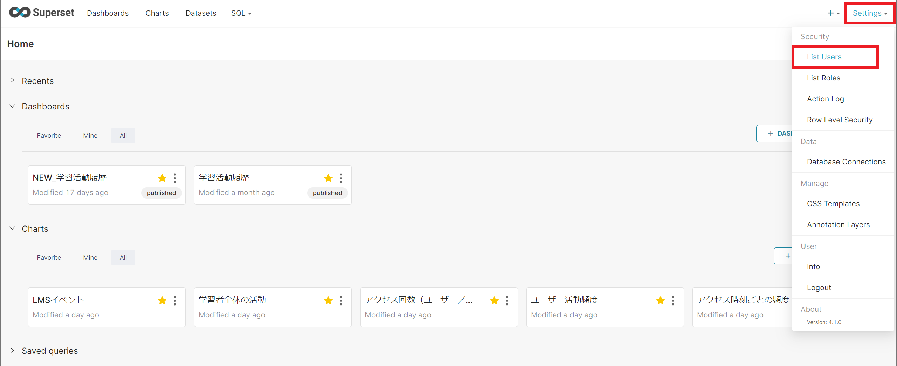
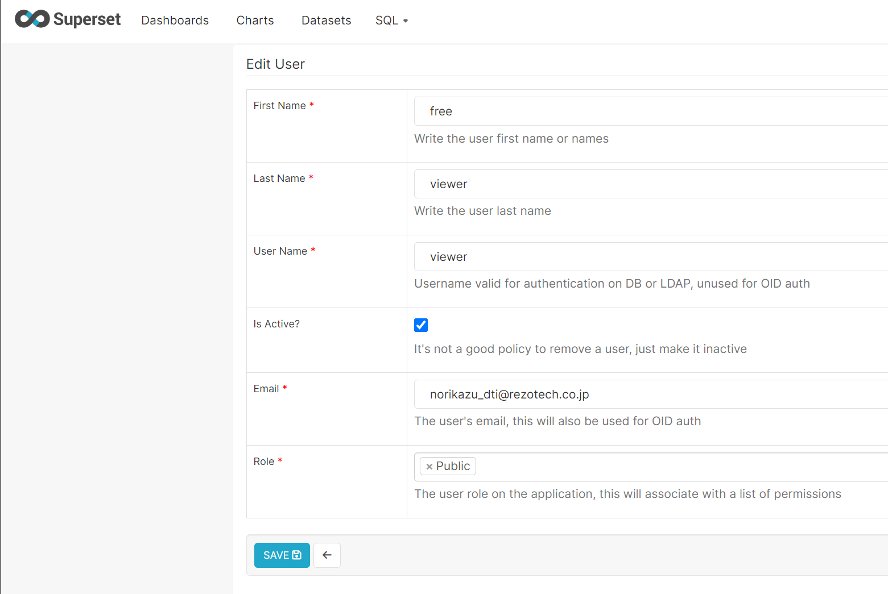
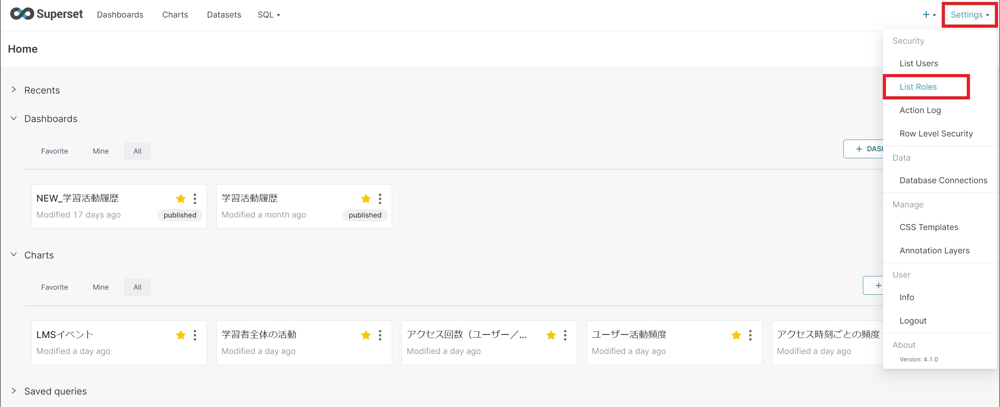
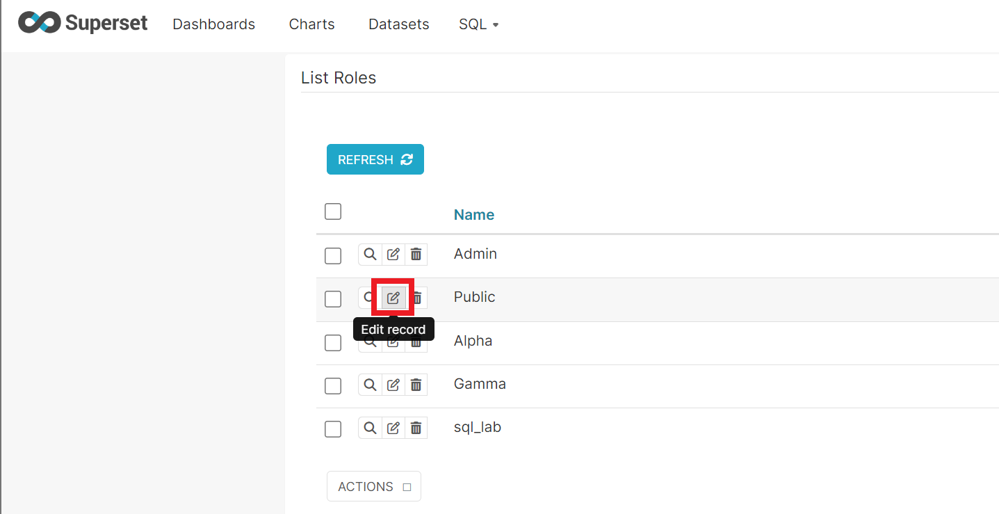
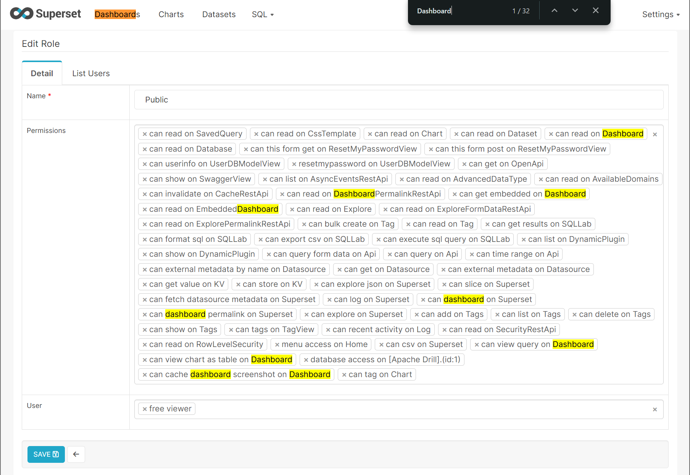
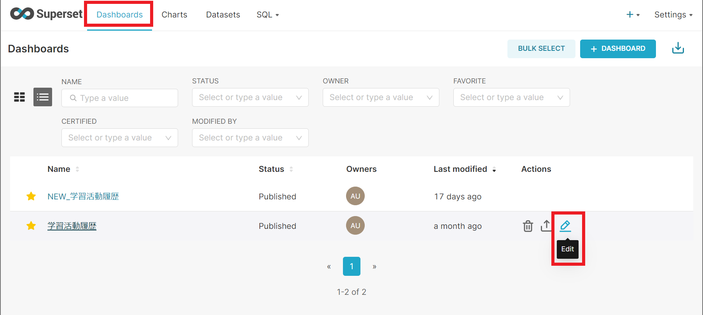
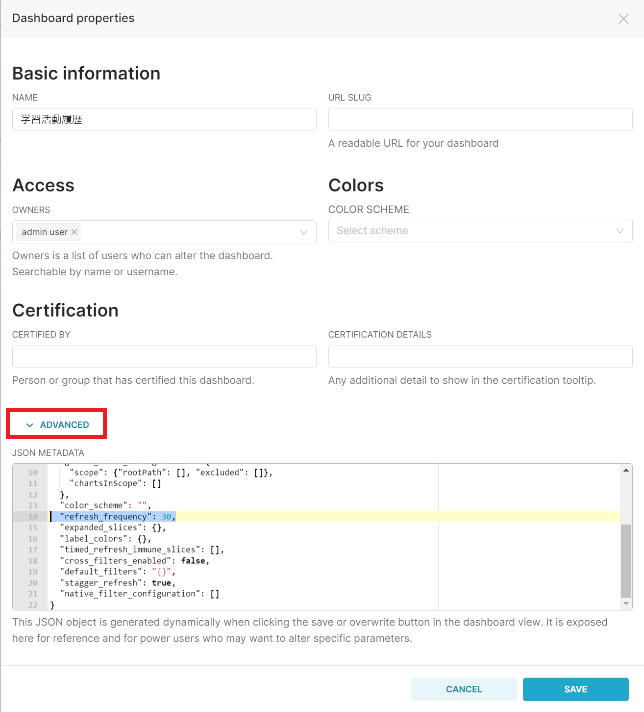

# Supersetダッシュボード設定
## ダッシュボード公開
Supersetのダッシュボード機能を用いて，チャートを以下のようにダッシュボードに配置する．  

## 閲覧用ユーザー作成
SupersetのSettingメニューより，List Usersを選択する．  

Public権限を持つユーザーを作成する．  

## PUBLIC権限の設定
SupersetのSettingメニューより，List Roleを選択する．  

ログイン無しで，ダッシュボードを閲覧できように，Public権限を設定する．  
Edit Recordアイコンより，Publicの権限を編集する．  

コネクションへのアクセス権限“database access on [Drill].(id:1)”　及び，Dashboardに関連する権限を，必要に応じて設定する．

### Public Roleに追加する権限
|No.|Permissions|
|----|-----|
|1|can read on Dashboard|
|2|can read on DashboardPermalinkRestApi|
|3|can get embedded on Dashboard|
|4|can read on EmbeddedDashboard|
|5|can dashboard on Superset|
|6|can dashboard permalink on Superset|
|7|can view query on Dashboard|
|8|can view chart as table on Dashboard|
|9|database access on [Drill].(id:1)|
|10|can cache dashboard screenshot on Dashboard|

上部メニューDashboardsより，ダッシュボード一覧を表示する．  
ダッシュボード一覧より，Actions列→Editを選択する．  

## 更新サイクルの設定

Dashboard properties画面のADVANCEDを選択し，拡張設定要素を表示する．  
JSON METADATAの要素に，30秒の更新サイクルを設定する．  

