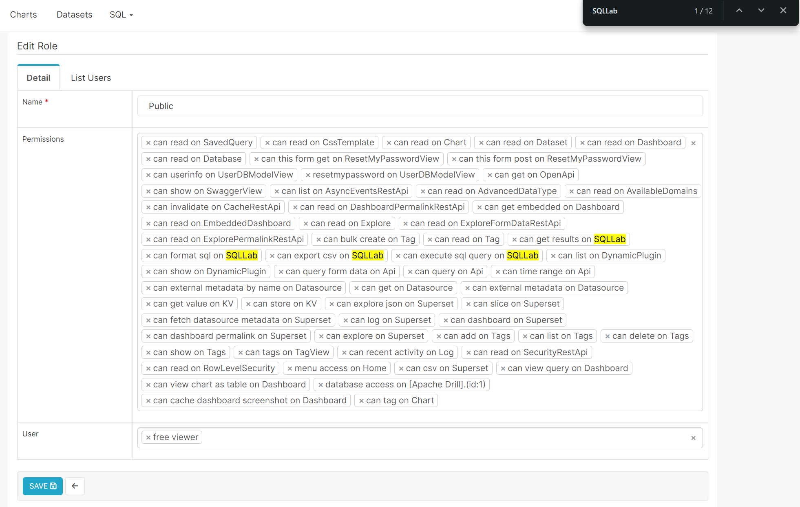

Supersetのダッシュボードの公開と同じように，権限設定を行う．  
SupersetのSettingメニューより，List Roleを選択し，Public権限を編集する．  
ログイン無しで，SQL実行結果をダウンロードできるように，Public権限を設定する．  

コネクションへのアクセス権限“database access on [Drill].(id:1)”　及び，SQLLabに関連する権限を，必要に応じて設定する．  

|No.|Permissions|
|----|----|
|1|can get results on SQLLab|
|2|can format sql on SQLLab|
|3|can export csv on SQLLab|
|4|can execute sql query on SQLLab|
|5|database access on [Drill].(id:1)|
