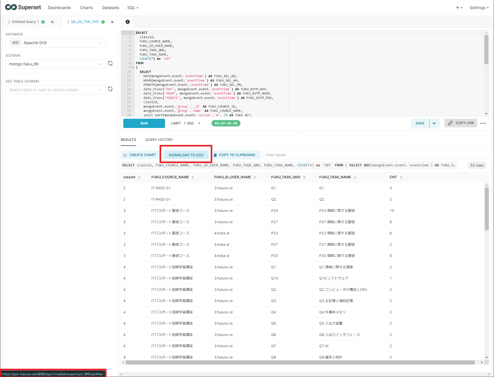
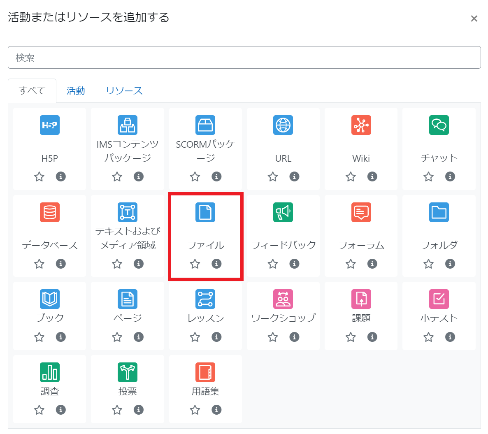
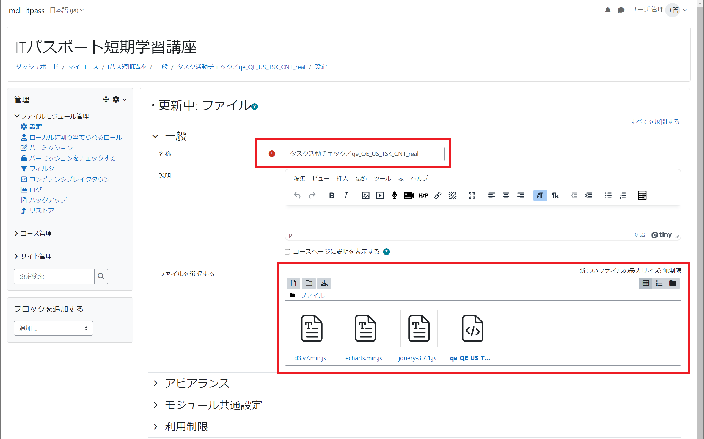

# ECharts組み込み：タスク活動チェック
##  Superset SQL保存
Supersetのメニュー「SQL」より「SQLLab」を選択し，SQLを登録する．  
リポジトリのSQLファイルを，参照ください．

```
SELECT
  classId,
  FUKU_COURCE_NAME,
  FUKU_ID_USER_NAME,
  FUKU_TASK_QNO,
  FUKU_TASK_NAME,
  COUNT(*) as `CNT`
FROM
(
  SELECT 
    DAY(mongoEvent.event.`eventtime`) AS FUKU_SEL_DD,
    HOUR(mongoEvent.event.`eventtime`) AS FUKU_SEL_HH,
    MINUTE(mongoEvent.event.`eventtime`) AS FUKU_SEL_MM,
    date_trunc('DAY', mongoEvent.event.`eventtime`) AS FUKU_EVTM_DAY,
    date_trunc('HOUR', mongoEvent.event.`eventtime`) AS FUKU_EVTM_HOUR,
    date_trunc('MINUTE', mongoEvent.event.`eventtime`) AS FUKU_EVTM_MIN,
    classId,
    mongoEvent.event.`group`.`_id` AS FUKU_COURCE_ID,
    mongoEvent.event.`group`.`name` AS FUKU_COURCE_NAME,
    split_part(mongoEvent.event.`action`,'#', 2) AS FUKU_ACT,
    userId,
    mongoEvent.event.`agent`.`name` AS FUKU_USER_NAME,
    concat(userId, ':', mongoEvent.event.`agent`.`name`) AS FUKU_ID_USER_NAME,
    mongoEvent.event.`target`.`_id` AS FUKU_TASK_URL,
    split_part(mongoEvent.event.`target`.`_id` ,'id=', 2) AS FUKU_TASK_ID,
    split_part(mongoEvent.event.`target`.`name`,'.', 1) AS FUKU_TASK_QNO,
    mongoEvent.event.`target`.`name` AS FUKU_TASK_NAME,
    split_part(mongoEvent.event.`membership`.`roles`[0],'#', 2) AS FUKU_ROLE
  FROM 
    mongo.fuku_db.mongoEvent
  ORDER BY
    mongoEvent.event.`eventtime` 
) as virtual_table
WHERE 
  FUKU_ROLE IN ('Learner') 
AND
  FUKU_TASK_NAME IS NOT NULL
AND
  FUKU_ACT IN ('Started', 'Submitted') 
GROUP BY
  classId,
  FUKU_COURCE_NAME,
  FUKU_ID_USER_NAME,
  FUKU_TASK_QNO,
  FUKU_TASK_NAME
ORDER BY
  classId,
  FUKU_COURCE_NAME,
  FUKU_ID_USER_NAME,
  FUKU_TASK_QNO,
  FUKU_TASK_NAME
```

##  Superset SqlLabのURL取得
「DOWNLOAD TO CSV」ボタンのリンクURLをコピーする．  



##  Moodleへのリソース，ファイル追加
Moodleを編集モードに変更し，活動またはリソースを追加するから，ファイルを選択する．  



##  ファイルページ設定
名称を指定し，可視化に必要なファイルをアップロードし，リソースを保存する．　　



## 追加するファイル
|No.|ファイル名|概要|
|----|----|----|
|1|d3.v7.min.js|オープンソースのJavaScriptデータ視覚化ライブラリ|
|2|ECharts.min.js|オープンソースのJavaScriptデータ視覚化ライブラリ|
|3|jquery-3.7.1.js|JavaScriptコードをより容易に記述できるようにするために設計されたJavaScriptライブラリ|
|4|qe_QE_US_TSK_CNT_real.html|本研究用に作成した，JavaScriptを含むhtmlファイル|

