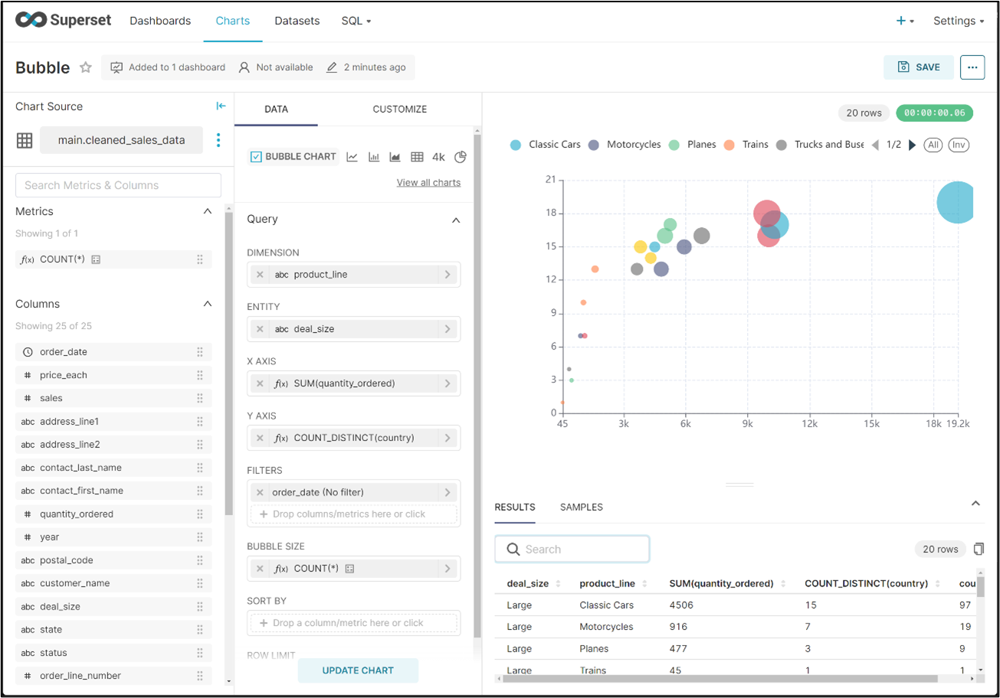

Apache EChartsは，Baiduによって開発された，データの視覚化ライブラリである．  
Supersetのグラフ機能では実現できない可視化を補うために使用した．  
本研究では，オープンソースの，Apache ECharts 5.5.1を採用した．  
  
EChartsはシステムへのインストールは必要ない．
Moodleにファイルをアップロードして動作させる．  

# ECharts使用に至る背景
EChartsは，Supersetの内部で使用されているJavaScript可視化ライブラリである．  
Supersetのグラフ種類は，EChartsと比較すると少ない．  
これは，Supersetはグラフごとにソースコードを開発しており，オープンソースによるボランティア的な開発のため，対応が遅いことが挙げられる．  
  
Supersetのチャート機能は，汎用的なインタフェースではあるが，パラメータの使用方法が限定されることがある．  
例えば以下の図では，必ずDEMENSIONS，ENTITYはグループ化キーとして扱われ，X AXIS，Y AXISは集計関数であることを前提としている．  
そのため，グラフパターンをうまく活用できない問題が発生した．  

