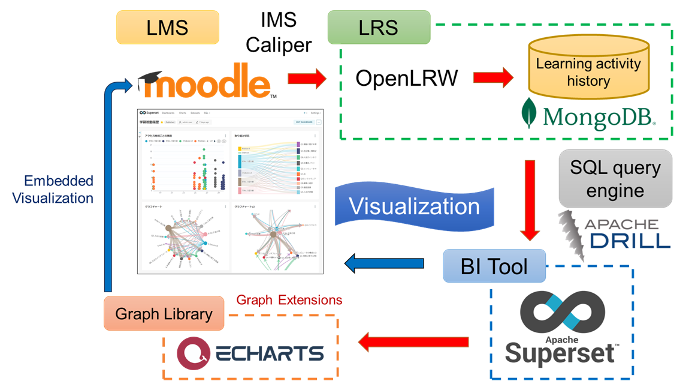

# Supplementary website in the ICLEA 2025 Paper  

# List of Visualization Graphs Used in This Study  
Please refer to the graph numbers corresponding to Questionnaire 3.

## Graph No.1 : Frequency by access time

## Graph No.2 : Engagement status

## Graph No.3 : Graph chart

## Graph No.4 : Graph chart V2

## Graph No.5 : User activity frequency

## Graph No.6 : Number of accesses (users / day)

## Graph No.7 : Activity of all learners

## Graph No.8 : Cumulative user events

## Graph No.9 : LMS events

## Graph No.10 : Task activity check (Moodle)

## Graph No.11 : User activity history (Moodle)

# Supplementary Information on the Research Website
A dedicated research website was developed for this study to support the simultaneous use of the LMS (Moodle) and the BI visualization dashboard (Apache Superset). The website was structured to display both interfaces side by side using the <iframe> tag. As shown in the figure below, the left pane displays the Moodle course content, while the right pane presents visualizations of learners’ activity data.

This configuration enabled learners to monitor their own learning progress in real time while comparing it with peer activity trends visualized on the dashboard. The seamless integration of course materials and visual analytics on a single screen aimed to enhance learner engagement and promote a sense of social presence during asynchronous learning.

Fig. Screenshot of the system's dashboard embedded with Moodle learning content
