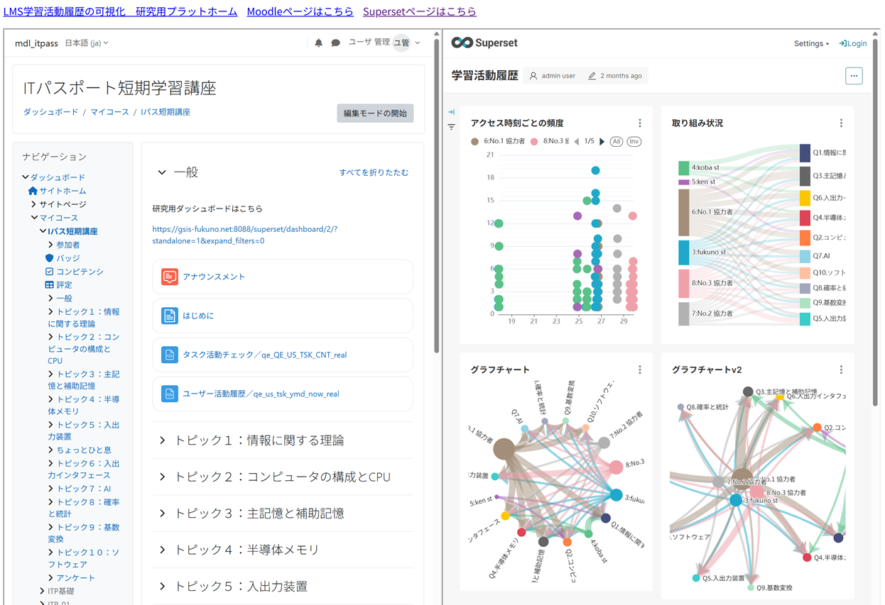

Figures of Visualization Graphs in the ICLEA 2025 Paper

We created a research website and set up an environment where Moodle and the Superset dashboard can be displayed simultaneously using the <iframe> tag. The left side of Figure 1 is the Moodle screen, and the right side is the dashboard screen visualized by Apache Superset.  

Figure 1  Screenshot of the system's dashboard embedded with Moodle learning content

# Graph No.1 : Frequency by access time

# Graph No.2 : Engagement status

# Graph No.3 : Graph chart

# Graph No.4 : Graph chart V2

# Graph No.5 : User activity frequency

# Graph No.6 : Number of accesses (users / day)

# Graph No.7 : Activity of all learners

# Graph No.8 : Cumulative user events

# Graph No.9 : LMS events

# Graph No.10 : Task activity check (ECharts)

# Graph No.11 : User activity history (ECharts)

